# Fluxo v8 - leitura

> Extraído de `Fluxo Processo RMA IA_v8.xlsx` (2026-10-06). O fluxo está desenhado em **formas** na aba "Fluxo RMA" (as células estão vazias): 173 caixas com texto e 149 setas. Esta nota é uma **leitura** do desenho, não regra confirmada. O agrupamento em 11 etapas mais o ramo do Parecer é **nosso**, para facilitar a revisão; o cliente não usa esses nomes.

## Raias do desenho

O desenho tem três cabeçalhos: **Técnico - Cadastro e Check list**, **Recuperanda** e **IA - Validando as informações**. A **Coordenação** aparece como passo dentro das raias, não como raia própria (ver [[duvidas]] D-11).

## As etapas, em uma linha cada

| Etapa | O que acontece no desenho |
| --- | --- |
| 1. Cadastro do processo | Técnico cadastra recuperanda, contador (com CRC) e nº do processo. A IA consulta o nº nos TJs: se acha, cadastra a(s) recuperanda(s); se não, cadastro manual. Técnico confere, marca se é produtor rural, corrige se preciso e comunica a recuperanda |
| 2. Envio e conferência dos documentos | Recuperanda recebe acesso e faz upload. Acima de 1 GB vai para o OneDrive. A IA compara com a lista do técnico, emite relatório de faltantes, separa os documentos por diretório e procura o balancete |
| 3. Análise técnica do balancete | Variações, mês atual contra anterior, saldo final do mês anterior igual ao inicial do atual. Divergência gera apontamentos para o técnico |
| 4. Conciliações com o balancete | Saldo bancário contra extrato, imobilizado, estoque, dívida ativa, fluxo de caixa realizado, contas a pagar e a receber |
| 5. DRE e resultado | IA gera a DRE a partir do balancete e compara com a DRE da recuperanda; custo e resultado contra receita líquida; EBITDA; notas fiscais contra DRE |
| 6. Análise documental e trabalhista | Estrutura societária e estabelecimentos, segmento, quadro de funcionários (quantidade, demissões, valor contra comprovante), INSS e FGTS |
| 7. Balancete, passivo e contingência | Ativo contra passivo mais PL, passivo extraconcursal (guias contra balancete), contingência, arrendamento mercantil |
| 8. Endividamento, índices e fórmulas | Adiantamento, contrato e câmbio; endividamento após o ajuizamento; declarações; fluxo de caixa projetado; índices de liquidez (corrente, geral, seca, imediata); tabelas de índices e de fórmulas; tópico de diligência |
| 9. Produtor rural | Só se for produtor rural: análise por fazenda, produtividade, comercialização, estoque, cronograma, pós-colheita, produção, fluxo financeiro e garantia da safra |
| 10. Conclusão e geração do RMA | Gera a conclusão, inclui informações do contador e da auditoria, gera o RMA |
| 11. Revisão e protocolo do RMA | Técnico analisa, Coordenação analisa, volta se houver correção; protocolo, arquivamento no diretório e e-mail comunicando |
| P. Parecer | Quando o balancete **não** foi enviado: a IA lê os documentos e emite um relatório de parecer, que passa por técnico e Coordenação e é protocolado |

Toda divergência nas etapas 3 a 7 cai em **"Gera apontamentos"**, que volta ao técnico e pode levar a um novo pedido de documentos à recuperanda.

## Onde o desenho quebra

Seis ligações que faltam ou estão soltas no desenho. No fluxograma abaixo elas aparecem **tracejadas**, como suposição nossa a confirmar (detalhe em [[duvidas]]):

- Arrendamento mercantil -> Adiantamento, contrato e câmbio (D-1)
- Gerar fórmulas -> Tabelas com as fórmulas (D-2)
- Técnico recebe o relatório -> Falta documentos? (D-3)
- Teve diligência? (etapa 8) sem a seta do "S" (D-4)
- Coordenação: tem correções no RMA? sem a seta do "N" (D-5)
- Recebe relatório do parecer -> Analisa relatório do parecer (D-6)

## Fluxograma

Renderizado também em [[fluxo-v8.svg]].

```mermaid
flowchart TD
  subgraph E1["1. Cadastro do processo"]
    n3(["INÍCIO"])
    n21["Efetua cadastro recuperanda - Portal RMA"]
    n515["Efetua cadastro do Contador e CRC"]
    n119["Cadastra número do proceso"]
    n190["Verifica nos TJs Nº do processo"]
    n191{"Identificou Nº do Processo"}
    n353["Efetua o cadastro manual"]
    n194["Efetua o cadstro da (s) Recuperandas"]
    n267["Verifica se o cadastro (s) estão corretos"]
    n279{"É Produtor Rural?"}
    n287["Selecione a opção - Produtor Rural"]
    n294["Deixa Desmarcado"]
    n216{"Cadastros estão corretos?"}
    n200["Edita o cadastro"]
    n346["Comunica a Recuperanda"]
  end
  subgraph E2["2. Envio e conferência dos documentos"]
    n170["Recuperanda recebe o acesso"]
    n173["Acessa a plataforma"]
    n174["Efetua o upload dos documentos/arquivo"]
    n175["Aguarda o término do upload"]
    n269{"É maior que 1G?"}
    n288["Carrega tudo para OneDrive"]
    n276["Compara com a Lista do Técnico"]
    n303{"Todos foram carregados?"}
    n308["Emite relatório dos faltantes"]
    n318["Comunica Técnico"]
    n248["Recebe o relatório"]
    n182{"Falta documentos?"}
    n150["Envia e-mail a recuperanda solicitando a documentação"]
    n265["Confirma OK!"]
    n2{"Enviou o Balancete?"}
    n360["Identifica Recuperanda"]
    n431["Separa documentos em cada diretório"]
    n313{"Identificou Balancete?"}
  end
  subgraph E3["3. Análise técnica do balancete"]
    n140["Executa Análise Técnica do Balancete"]
    n243["Analisa Variações"]
    n245["Analisa mês atual com anterior"]
    n246["Gera relatório divergência"]
    n401["Analisa Balancete"]
    n404["Verifica Saldo final mês ant. = inicio mês atual"]
    n347["Verifica Divergência no Saldo anterior do Balancete"]
    n411{"Existem divergências?"}
    n422["Gera apontamentos"]
  end
  subgraph E4["4. Conciliações com o balancete"]
    n434["ANÁLISE CRUZADA<br/>Saldo Bancário c/ Extrato Bancário"]
    n436["IMOBILIZADO<br/>Relatório Imobilizado c/ Saldo Contábil"]
    n437["ESTOQUE<br/>Estoque com Balancete"]
    n438["DÍVIDA ATIVA<br/>Doc. Recuperanda com Balancete"]
    n384["Fluxo de Caixa Realizado"]
    n439["FLUXO DE CAIXA<br/>Doc. Recuperanda com Balancete"]
    n440["CONTAS A PAGAR<br/>Doc. Recuperanda com Balancete"]
    n441["CONTAS A RECEBER<br/>Doc. Recuperanda com Balancete"]
    n557{"Existem divergências?"}
  end
  subgraph E5["5. DRE e resultado"]
    n571["GERA DRE<br/>Baseado no Balancete"]
    n576["ANÁLISE<br/>DRE Recuperanda<br/>x<br/>DRE da IA"]
    n498["EFETUA ANÁLISE<br/>Custo x Receita Liquida"]
    n577["EFETUA ANÁLISE<br/>Resultado x Receita Liquida"]
    n580["Gerar Cálculo EBITDA"]
    n583["Compara Relatório de NF's Recuperanda com DRE"]
    n585{"Existem divergências?"}
  end
  subgraph E6["6. Análise documental e trabalhista"]
    n591["Efetua Análise Documental"]
    n592["ATIVIDADE EMPRESARIAL<br/>Estrutura Soc. e Estabelecimentos"]
    n595["Verifica Seguimento de Atuação"]
    n597["QUADRO DE FUNCIONÁRIOS<br/>Qtd, Demissões, Transferência, Valor"]
    n599["QUADRO DE FUNCIONÁRIOS<br/>Valor x Comprovante Pgto"]
    n600{"Existem divergências?"}
    n606["INSS e FGTS<br/>Comprovantes x Guia"]
    n607{"Existem divergências?"}
  end
  subgraph E7["7. Balancete, passivo e contingência"]
    n613["BALANCETE<br/>Ativo c/ Passivo<br/>+<br/>PL"]
    n615{"Existem divergências?"}
    n625["PASSIVO EXTRACONCURSAL<br/>Obrig. Social, Tributária, Parcelam."]
    n628["Verificar Guias com Balancete"]
    n631{"Existem divergências?"}
    n323["CONTINGÊNCIA<br/>Doc. Recuperanda X Balancete"]
    n326["Arrendamento Mercantil"]
  end
  subgraph E8["8. Endividamento, índices e fórmulas"]
    n328["Adiantamento, Contrato e Câmbio"]
    n334["Endividamento após Ajuizamento"]
    n366["DECLARAÇÃO REC.<br/>Trib. Trabalhista, Fornecedores, Empréstimos Financ."]
    n369["Fluxo de Caixa Projetado"]
    n373["GERAR ÍNDICES LIQUIDEZ<br/>Corrente, Geral, Seca e Imediata"]
    n381["TABELAS<br/>Gera tabelas com os Indicies"]
    n382["GERAR FÓRMULAS<br/>Efetua cálculo das fórmulas"]
    n417["TABELAS<br/>Gera tabelas com as Fórmulas"]
    n418{"Teve Diligência?"}
    n446["Não haverá o tópico no RMA"]
    n428["Inseri no RMA"]
  end
  subgraph E9["9. Produtor rural"]
    n530["Efetua análise por Fazenda"]
    n534["Analisa Produtividade"]
    n535["Analisa Comercialização"]
    n537["Analisa Estoque"]
    n540["Analisa Cronograma Rural"]
    n543["Analisa Pós Colheita"]
    n547["Valida Produção"]
    n552["Analisa Fluxo Financeiro da Safra"]
    n560["Analisa Garantia sobre a Safra"]
    n567{"Teve Diligência?"}
    n611["Não haverá o tópico no RMA"]
    n582["Inseri no RMA"]
  end
  subgraph E10["10. Conclusão e geração do RMA"]
    n450{"É PRODUTOR RURAL?"}
    n453["GERAR CONCLUSÃO"]
    n405["Incluir informações apresentadas Contador e Auditoria"]
    n460["GERAR RMA"]
  end
  subgraph E11["11. Revisão e protocolo do RMA"]
    n463["Comunicar Técnico"]
    n464["Técnico recebe RMA"]
    n465["Técnico analisa RMA"]
    n469{"Tem correções?"}
    n483["Envia para Coordenação"]
    n487["Coordenação analisa RMA"]
    n490{"Tem correções?"}
    n508["Retorna RMA ao Técnico"]
    n516["Efetua Protocolo"]
    n520["Insere no diretório Documento Protocolado"]
    n521["Envia e-mail comunicando o protocolo"]
    n523(["FIM"])
  end
  subgraph P["P. Parecer (quando não há balancete)"]
    n320["Analisar os documentos enviados"]
    n325["Efetua a leitura dos documentos enviados"]
    n312["Emite relatório do Parecer com os documentos enviados"]
    n375["Comunica Técnico"]
    n376["Rcebe Relatório do Parecer"]
    n377["Analisa Relatório do Parecer"]
    n188{"Tem correções?"}
    n378["Técnico efetua correção Relatório do Parecer"]
    n398["Envia a Coordenação"]
    n406["Coordenação analisa"]
    n410{"Tem correções?"}
    n229["Retorna para Técnico"]
    n415["Protocola"]
    n420(["FIM"])
  end
  n3 --> n21
  n182 -->|S| n150
  n182 -->|N| n265
  n265 --> n2
  n194 --> n267
  n191 -->|N| n353
  n119 --> n190
  n190 --> n191
  n191 -->|S| n194
  n267 --> n279
  n216 -->|N| n200
  n170 --> n173
  n173 --> n174
  n174 --> n175
  n175 --> n269
  n269 -->|N| n276
  n269 -->|S| n288
  n288 --> n276
  n276 --> n303
  n303 -->|N| n308
  n313 -->|S| n140
  n308 --> n318
  n318 --> n248
  n2 -->|S| n313
  n2 -->|N| n320
  n303 -->|S| n360
  n313 -->|N| n318
  n188 -->|S| n378
  n377 --> n188
  n376 --> n378
  n312 --> n375
  n188 -->|N| n398
  n378 --> n398
  n398 --> n406
  n410 -->|S| n188
  n410 -->|N| n229
  n415 --> n420
  n360 --> n431
  n431 --> n313
  n406 --> n410
  n229 --> n415
  n279 -->|S| n287
  n279 -->|N| n294
  n216 -->|S| n346
  n353 --> n267
  n294 --> n216
  n287 --> n216
  n200 --> n346
  n346 --> n170
  n150 --> n174
  n140 --> n243
  n243 --> n245
  n245 --> n246
  n246 --> n401
  n401 --> n404
  n404 --> n347
  n375 --> n376
  n411 -->|S| n422
  n422 --> n318
  n411 -->|N| n434
  n434 --> n436
  n436 --> n437
  n437 --> n438
  n438 --> n384
  n439 --> n440
  n440 --> n441
  n557 -->|S| n422
  n557 -->|N| n571
  n571 --> n576
  n576 --> n498
  n577 --> n580
  n580 --> n583
  n583 --> n585
  n585 -->|S| n422
  n591 --> n592
  n592 --> n595
  n595 --> n597
  n597 --> n599
  n600 -->|N| n606
  n599 --> n600
  n600 -->|S| n422
  n607 -->|S| n422
  n606 --> n607
  n607 -->|N| n613
  n613 --> n615
  n615 -->|N| n625
  n615 -->|S| n422
  n625 --> n628
  n628 --> n631
  n631 -->|N| n323
  n631 -->|S| n422
  n323 --> n326
  n328 --> n334
  n334 --> n366
  n366 --> n369
  n369 --> n373
  n373 --> n381
  n381 --> n382
  n417 --> n418
  n418 -->|N| n446
  n446 --> n428
  n428 --> n450
  n450 -->|N| n453
  n450 -->|S| n530
  n453 --> n405
  n460 --> n463
  n464 --> n465
  n463 --> n464
  n465 --> n469
  n469 -->|S| n483
  n483 --> n487
  n487 --> n490
  n508 --> n464
  n490 -->|S| n508
  n520 --> n521
  n521 --> n523
  n516 --> n520
  n469 -->|N| n516
  n530 --> n534
  n534 --> n535
  n535 --> n537
  n537 --> n540
  n540 --> n543
  n543 --> n547
  n547 --> n552
  n552 --> n560
  n560 --> n567
  n567 -->|N| n611
  n567 -->|S| n582
  n611 --> n582
  n582 --> n460
  n325 --> n312
  n320 --> n325
  n347 --> n411
  n384 --> n439
  n441 --> n557
  n405 --> n460
  n498 --> n577
  n515 --> n119
  n21 --> n515
  n585 -->|N| n591
  n326 -.->|?| n328
  n382 -.->|?| n417
  n248 -.->|?| n182
  n418 -.->|S| n428
  n490 -.->|N| n516
  n376 -.->|?| n377
  classDef inferido stroke-dasharray: 4 4
```

